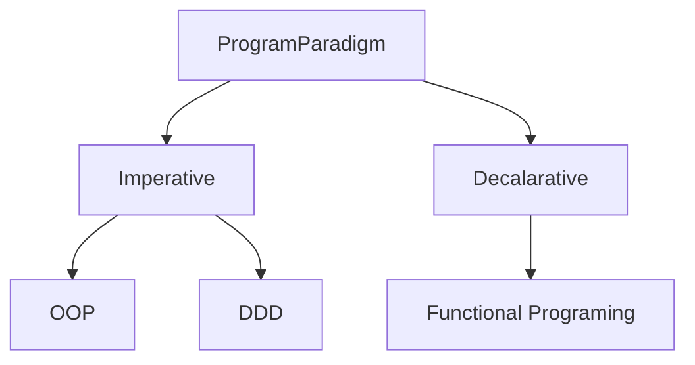

# resource-program-paradigm

## PLAN
|Domain|Boundary|Input|Output|
|---|---|---|---|
|#AOP|Aspect-Oriented Programming|
|#OOP|Object-Oriented Programming|
|#DDD|Domain-Driven Design|
|#IOC|Inversion of Control|
## DO
## CHECK
## ACTION
